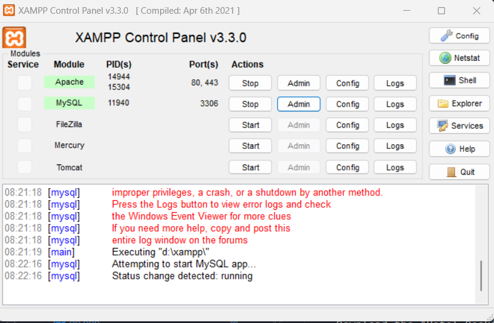
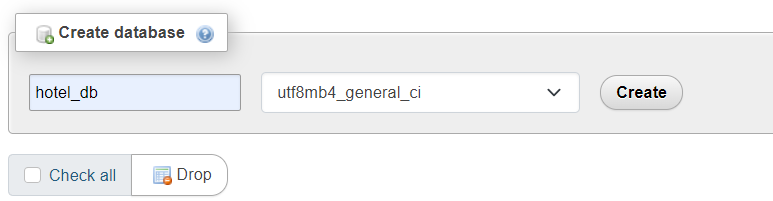
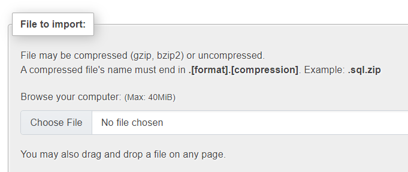
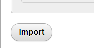

# Hotel Booking Management System

Welcome to the Hotel Booking Management System! This system allows you to manage hotel bookings efficiently.

## Installation Guide

Follow these steps to set up the Hotel Booking Management System on your local environment:

1. **Download XAMPP:**
   - Download and install [XAMPP](https://www.apachefriends.org/index.html) on your system.

2. **Choose a Text Editor:**
   - Select a text editor of your choice. Recommended: [Notepad++](https://notepad-plus-plus.org/) or [Sublime Text 3](https://www.sublimetext.com/).

3. **Download the System:**
   - Download the "Hotel_Booking_Management_System" from this repository.

4. **Extract and Copy:**
   - Extract the downloaded ZIP file and copy the "Hotel_Booking_Management_System" folder.

5. **Paste in XAMPP Root Directory:**
   - Paste the folder inside the XAMPP root directory.
     - Example path: `C:\xampp\htdocs\` (for XAMPP on C: drive)

6. **Open PHPMyAdmin:**
   - Open PHPMyAdmin by visiting [http://localhost/phpmyadmin](http://localhost/phpmyadmin).
   - make sure Apache & MySQL is running
   
   - Click on admin button of MySQL

7. **Create Database:**
   - Create a new database named `hotel_db`.

8. **Import SQL File:**
   - Import the `hotel_db.sql` file found in the SQL file folder of the downloaded ZIP package into the `hotel_db` database.

9. **Run the System:**
   - Open your web browser and go to [http://localhost/Hotel_Booking_Management_System](http://localhost/Hotel_Booking_Management_System).

**Login Details:**

- Default admin credentials:
  - **Admin**
    - Username: admin
    - Password: admin123
`You can use this `

## Features

- **Booking Management:**
  - Efficiently manage hotel bookings.
  
- **User Management:**
  - Create and manage user accounts.

- **Admin Panel:**
  - Access the admin panel for administrative tasks.

## License

This project is licensed under the MIT License - see the [LICENSE.md](LICENSE.md) file for details.